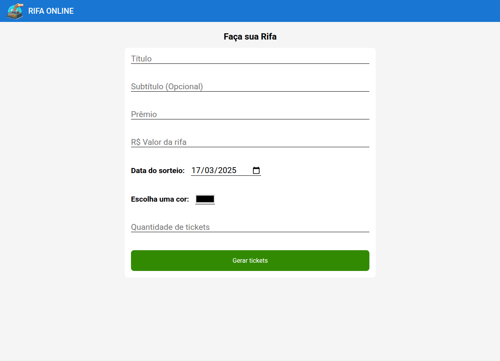
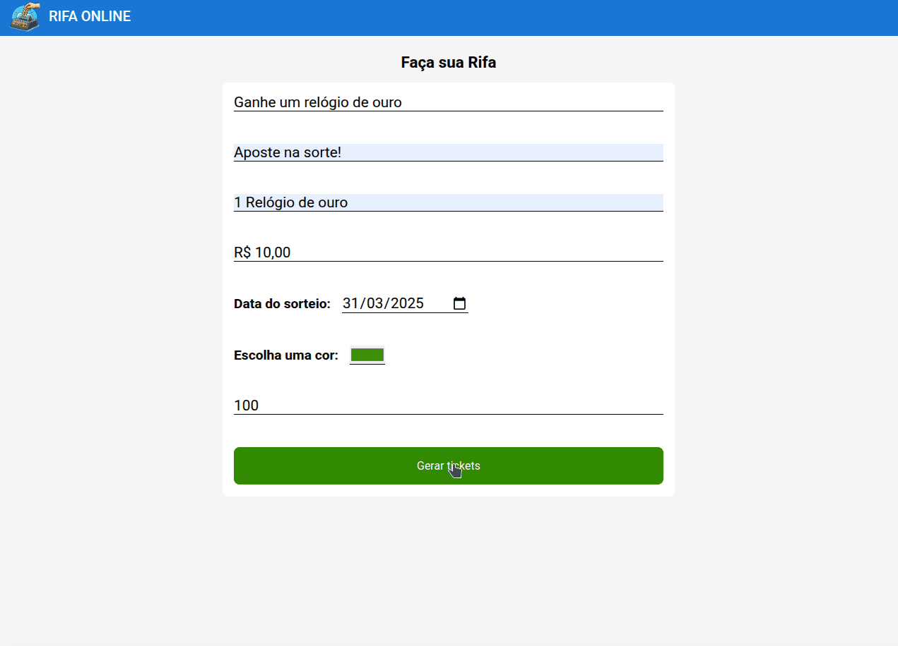

<h1>Raffle Ticket Generator </h1>



## Tabela de conteúdos
* [Sobre](#-sobre)
* [Tecnologias utilizadas](#-tecnologias-utilizadas)
* [Instalação](#️-instalação)
* [Demonstração de uso](#demonstração-de-uso)
* [Licença](#licença)

## 📌 Sobre

`Raffle Ticket Generator` é uma solução própria para geração e impressão de bilhetes de rifa. Basta preencher o formulário, escolher uma cor e pronto! Tickets gerados e prontos para impressão!

[Visite o projeto](https://danwiilocarvalho.github.io/raffle-ticket-generator/)

## 💻 Tecnologias utilizadas

<div style="display: flex; flex-wrap: wrap; justify-content: flex-start; gap: 0.7rem">


</div>
<br>
As bibliotecas foram utilizadas para os seguintes propósitos:

* Inicialização do projeto com o `Vite` e utilização da biblioteca `React` para construção da página.

* `React Hook Form` junto ao `Zod` para validação do formulário
* Estilização com `Styled-Components`

## ⚙️ Instalação

### Requisitos

Antes de iniciar, você deve ter o Node.js, NPM e o Git instalados em sua máquina. O Vite 5.2.0, versão utilizada neste projeto, requer as versões 18+ ou 20+ do Node.js.

### Clonando o projeto

Para executar o projeto localmente, você deve primeiramente cloná-lo em sua máquina. Para isso, você pode executar o seguinte comando em seu terminal:

```bash
git clone https://github.com/DanwiiloCarvalho/raffle-ticket-generator.git
```

Logo em seguida, você deve acessar a pasta do projeto e instalar todas as dependências com os seguintes comandos:

```bash
cd raffle-ticket-generator
npm install
```

Para executar o servidor de desenvolvimento, basta executar:

```bash
npm run dev
```

Observe no terminal o endereço designado como `Local`, então acesse este endereço em seu navegador para ver o resultado.

## Demonstração de uso

`Raffle Ticket Generator` consiste em uma única página com um formulário para o preenchimento das informações do bilhete. Estão disponíveis o seguinte campos:

* Título
* Subtítulo (Opcional)
* Prêmio
* Valor da rifa
* Data do sorteio
* Escolha uma cor
* Quantidade de tickets

Após preencher os campos e clicar em `Gerar tickets`, os bilhetes são gerados com seus respectivos números e o assistente de impressão do navegador é aberto, onde você pode escolher qual impressora deseja utilizar, ou se deseja gerar um PDF dos bilhetes:

<br>

<strong>Obs: A quantidade máxima permitida de tickets é de 1000 </strong>

## Licença
Este projeto está sob a licença MIT. Consulte o arquivo `LICENSE` para mais informações.